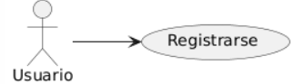

## Caso de uso
Nombre: Registrarse en la aplicacion

Diagrama:
@startuml
left to right direction
:Usuario: --> (Registrarse)
@enduml

### Precondiciones:
- El nombre de usuario no debe estar registrado previamente en el sistema.
- El sistema debe estar disponible para nuevos registros.

### Flujo Básico:
1. El usuario accede a la página de registro.
2. El sistema muestra un formulario de registro a rellenar.
3. El usuario completa el formulario con sus datos.
4. El sistema verifica que los datos introducidos por el usuario son válidos.
5. El sistema registra finalmente al usuario.

### Postcondiciones:
- El usuario que intenta registrarse queda registrado en el sistema
- El usuario podrá iniciar sesión en la aplicación haciendo uso de sus nuevas credenciales (usuario, contraseña).
- El sistema actualiza la base de datos con las credenciales del nuevo usuario.

### Reglas de Negocio:
- La contraseña debe ser segura (combinación de caracteres especifica y longitud máxima de caracteres).

