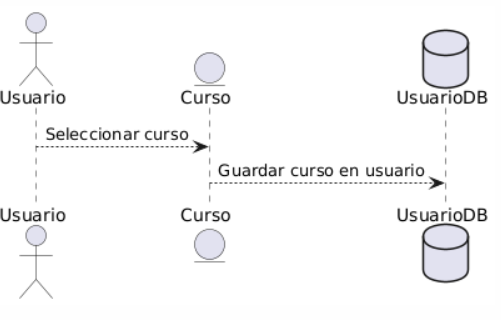

## Caso de uso
Nombre: Subir cursos a la plataforma

Diagrama:
@startuml
actor Usuario
entity Curso
database UsuarioDB
Usuario --> Curso : Seleccionar curso
Curso --> UsuarioDB : Guardar curso en usuario
@enduml

### Precondiciones:
- El usuario debe estar logueado como Colaborador.
- El curso debe estar guardado en el ordenador del Colaborador.
- El curso debe estar guardado en JSON.

### Flujo Básico:
1. El colaborador selecciona el boton Importar Curso.
2. El colaborador busca el curso deseado.
3. Una vez seleccionado, el sistema lee el archivo y si esta correcto el archivo, aparecera en la lista del colaborador.

### Postcondiciones:
- Una vez el curso seleccionado, este aparece en la lista privada del Colaborador.
- Se guardara el curso en la lista privada hasta que se realice alguna accion sobre este.

### Reglas de Negocio:
- Se considerara "Autor" del curso a aquel usuario que suba el curso.
- Pueden existir cursos con el mismo nombre

