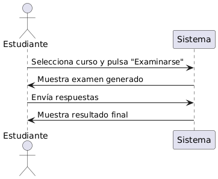

## Caso de uso
Nombre: Examinarse de un curso 

Diagrama:
@startuml
actor Estudiante
participant Sistema

Estudiante -> Sistema : Selecciona curso y pulsa "Examinarse"
Sistema -> Estudiante : Muestra examen generado
Estudiante -> Sistema : Envía respuestas
Sistema -> Estudiante : Muestra resultado final
@enduml

### Precondiciones:
- El usuario debe estar logueado como Estudiante.
- El curso debe estar descargado y disponible en la biblioteca privada.
- El estudiante debe a ver elegido la estrategia de aprendizaje previamente.

### Flujo Básico:
1. El estudiante elige el curso.
2. Selecciona el botón examinarse.
3. El sistema consulta la estrategia de aprendizaje.
4. El sistema generá preguntas de todos los bloques pertenecientes al curso.
5. El estudiante empieza el examen.
6. Al finalizar el examen, el sistema evalúa las respuestas.
7. El sistema muestra el resultado final del examen al estudiante.

### Postcondiciones:
- El estudiante pueder ver su nota.
- El estudiante puede volver a realizar el examen.

### Reglas de Negocio:
- El examen será generado de acuerdo a la estrategia de aprendizaje.
- Las preguntas del examen serán pertencientes a las preguntas de los bloques de conteni

