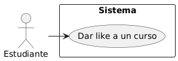

## Caso de uso
Nombre: Dar like a un curso

Diagrama:
@startuml
actor Estudiante
rectangle Sistema {
  (Dar like a un curso)
}
Estudiante -> (Dar like a un curso)
@enduml

### Precondiciones:
- El usuario debe estar logueado como Estudiante.
- El curso debe estar publicado.
- El estudiante no debe hacer dado like previamente al curso.

### Flujo Básico:
1. El estudiante selecciona un curso.
2. Con el curso escogido, dandole al boton Dar like , el sistema verifica que el estudiante aún no ha dado like a ese curso.
3. El sistema incrementa el contador de likes del curso.
4. El sistema registra la acción y actualiza la vista aumentando el numero de likes en uno.

### Postcondiciones:
- El curso muestra el nuevo número de likes actualizado.
- La relación entre el estudiante y el curso queda registrada.

### Reglas de Negocio:
- Un estudiante solo puede dar un like por curso.
- Los likes no se pueden deshacer.

