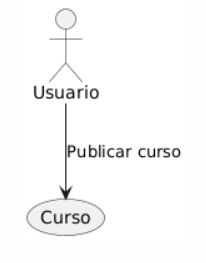

## Caso de uso
Nombre: Compartir cursos

Diagrama:
@startuml
actor Usuario
Usuario --> (Curso) : Publicar curso
@enduml

### Precondiciones:
- El curso a compartir ha de estar subido en privado por el Colaborador.
- El curso no debe estar publico.

### Flujo Básico:
1. El colaborador selecciona el curso que quiere publicar.
2. Presiona sobre el boton compartir que hay en la ventana.
3. El curso pasara a estar en la ventana de cursos publicos.

### Postcondiciones:
- El colaborador tendra el curso en ambas listas, sus cursos y todos los cursos publicados.
- El curso ahora es descargable por parte de un estudiante.

### Reglas de Negocio:
- Una vez compartido, no se puede poner en privado el curso.

