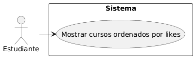

## Caso de uso
Nombre: Mostrar una lista ordenada de los cursos según el número de likes

Diagrama:
@startuml
rectangle Sistema {
  (Mostrar cursos ordenados por likes)
}
Estudiante -> (Mostrar cursos ordenados por likes)
@enduml

### Precondiciones:
- El usuario debe estar logueado como Estudiante.
- Deben existir cursos publicados.

### Flujo Básico:
1. El estudiante pulsa el botón de Tendencias.
2. El sistema recupera todos los cursos publicados con sus respectivos likes.
3. El sistema ordena los cursos de forma descendente según el número de likes de cada curso.
4. El sistema muestra al estudiante la lista ordenada de cursos.

### Postcondiciones:
- El estudiante visualiza correctamente una lista de cursos ordenada por likes.
- No se permite modificar la vista.

### Reglas de Negocio:
- Solo los cursos publicados deben ser mostrados.
- El orden debe ser de mayor a menor número de likes.

