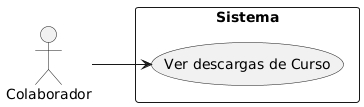

## Caso de uso
Nombre: Ver el número de descargas que ha recibido un curso

Diagrama:
@startuml
left to right direction
actor Colaborador
rectangle Sistema {
  (Ver descargas de Curso)
}
Colaborador --> (Ver descargas de Curso)
@enduml

### Precondiciones:
- El usuario debe estar logueado como Colaborador.
- Deben existir cursos publicados.

### Flujo Básico:
1. El colaborador accede al panel de cursos publicados.
2. El sistema muestra distintas informaciones entre ellas el número de descargas que ha recibido cada curso.

### Postcondiciones:
- El colaborador visualiza el número de descargas de cada curso publicado.
- No se permite modificar la información de esa vista.

### Reglas de Negocio:
- Cada vez que un estudiante descargue un curso, el numero de descargas de ese curso se incrementa en uno.
- Solo los colaboradores pueden acceder a esta información.

