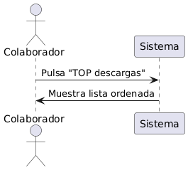

## Caso de uso
Nombre: Mostrar una lista ordenada de los cursos según el número de descargas

Diagrama:
@startuml
actor Colaborador
participant Sistema

Colaborador -> Sistema : Pulsa "TOP descargas"
Sistema -> Colaborador : Muestra lista ordenada
@enduml

### Precondiciones:
- El usuario debe estar logueado como Colaborador.
- Deben existir varios cursos publicados.

### Flujo Básico:
1. El colaborador pulsa el botón TOP descargas.
2. El sistema obtiene la lista de todos los cursos publicados.
3. El sistema ordena la lista de cursos de forma de descente por el número de total de descargas.
4. El colaborador visualiza la lista de cursos ordenados.

### Postcondiciones:
- Se muestra correctamente una lista ordenada de cursos por número de descargas en orden descendente.
- El sistema no permite modificar o eliminar cursos desde esta vista.

### Reglas de Negocio:
- Cada descarga del curso implica una actualizacion de la estadistica del curso.
- Solo los cursos publicados deben ser incluidos.

