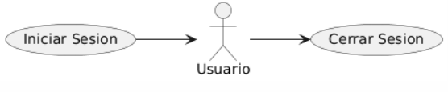

## Caso de uso
Nombre: Cerrar Sesion

Diagrama:
@startuml
left to right direction
actor Usuario
(Iniciar Sesion) --> Usuario
Usuario --> (Cerrar Sesion)
@enduml

### Precondiciones:
- El usuario debe estar registrado en el sistema.
- El sistema debe estar logueado en el sistema.

### Flujo Básico:
1. El usuario selecciona el boton de cerrar sesion.
2. El sistema cerrara la pestaña principal.
3. El sistema dejara de tener un usuario logueado.
4. El sistema abrira la ventana de inicio de sesion.

### Postcondiciones:
- El usuario podrá voler a iniciar sesion o cerrar la aplicacion.
- El sistema podra ser capaz de permitir a otro usuario loguearse

### Reglas de Negocio:
- Un usuario solo puede cerrar sesion si esta logueado en el sistema

