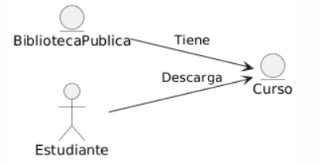

## Caso de uso
Nombre: Instalar curso disponible en biblioteca interna

Diagrama:
@startuml
left to right direction
entity BibliotecaPublica
entity Curso
actor Estudiante
BibliotecaPublica --> Curso : Tiene
Estudiante --> Curso : Descarga
@enduml

### Precondiciones:
- El usuario debe estar logueado como Estudiante.
- El curso a escoger debe estar subido y publicado por un Colaborador.
- El curso no debe estar haber sido descargado anteriormente por el Estudiante.

### Flujo Básico:
1. El estudiante elige el curso que quiere descargarse.
2. Con el curso escogido, dandole a Descargar, este se le guardara en la biblioteca privada.
3. En la biblioteca privada el estudiante puede ejecutar el curso y empezarlo.

### Postcondiciones:
- El estudiante tiene ya descargado ese curso en su biblioteca interna.
- El sistema actualizara la estadistica del curso.
- El estudiante ya no podra eliminar ese curso de su biblioteca interna.

### Reglas de Negocio:
- Cada descarga del curso implica una actualizacion de la estadistica del curso.

