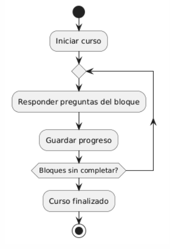

## Caso de uso
Nombre: Ejecutar y realizar Curso

Diagrama:
@startuml
start
:Iniciar curso;
repeat
  :Responder preguntas del bloque;
  :Guardar progreso;
repeat while (Bloques sin completar?)
:Curso finalizado;
stop
@enduml

### Precondiciones:
- El curso debe estar publico.
- El estudiante debe tener descargado el curso correspondiente.
- El estudiante tendra que haber escogido una estrategia antes de iniciar el curso.

### Flujo Básico:
1. El estudiante selecciona el curso que quiere abrir.
2. Si el curso no se ha empezado nunca, se escogera una estrategia para el estudio.
3. Con la ventana del curso, se puede ver los bloques de contenido y se pueden selecionar y abrir.
4. En cada Bloque de contenido, hay preguntas que se pueden realizar.

### Postcondiciones:
- El sistema guarda el estado actual del curso, incluyendo los bloques completados.
- Una vez iniciado, el curso queda accesible para que el estudiante lo continúe en cualquier momento desde su biblioteca interna.

### Reglas de Negocio:
- Cada vez que se acabe un bloque de contenido, se guardara el progreso y las estadisticas de este.
- Un bloque de contenido sera marcado como acabado cuando se respondan a todas las preguntas.
- Se puede rehacer un bloque de contenido ya acabado.

