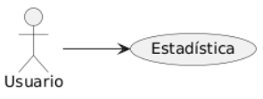

## Caso de uso
Nombre: Ver estadísticas de uso en la plataforma

Diagrama:
@startuml
left to right direction
actor Usuario
Usuario --> (Estadística)
@enduml

### Precondiciones:
- El usuario debe estar logueado como Estudiante.

### Flujo Básico:
1. El estudiante debe hacer clic sobre el boton "Stats".
2. Se abrira una ventana con informacion sobre cuantos aciertos seguidos lleva o tiempo conectado.

### Reglas de Negocio:
- Con cada curso que hacen ejercicios, hay que actualizar las estadisticas del usuario.
