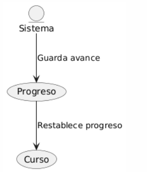

## Caso de uso
Nombre: Guarda estado del curso para un usuario

Diagrama:
@startuml
entity Sistema

Sistema --> (Progreso) : Guarda avance
(Progreso) --> (Curso): Restablece progreso
@enduml

### Precondiciones:
- El estudiante debe tener importado el curso.

### Flujo Básico:
1. El estudiante selecciona un curso a ejecutar.
2. El sistema busca en la base de datos, sobre el progreso del Estudiante.
3. El sistema marca como finalizado bloques de contenido del curso.

### Postcondiciones:
- Cuando el estudiante vuelva a meterse al curso, su progreso se restablecera.
- El sistema ante cualquier avance en el curso lo guardara para futuras ocasiones.
-  Ante cualquier cambio en el progreso el sistema lo guardara en memoria.

### Reglas de Negocio:
- Cada descarga del curso implica una actualizacion de la estadistica del curso.
- No se puede borrar ningun progreso.
- El progreso que se guarda es sobre los bloques de contenido que hay hechos.

